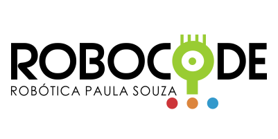

<h1 align="center">ROBOCODE-CPS</h1>

<p align="center">
  
</p>

#
### SOBRE

- Diretório contendo projeto desenvolvido em Java para o 10° Torneio Robocode, promovido pelo Centro Paula Souza.
- <strong>Proposta:</strong> Utiliza o Software Robocode®, que é um jogo de programação, onde o objetivo é desenvolver/adaptar um tanque de guerra para a batalha contra outros tanques em uma arena virtual utilizando a linguagem de programação Java. Usado para ferramenta no processo de ensino-aprendizagem em programação e inteligência artificial (AI).

#
### TECNOLOGIA
&nbsp;

#
### CONTRIBUIÇÃO

```
$ git clone https://github.com/kaiquesouzasantos/java-robocode-cps.git 
```
